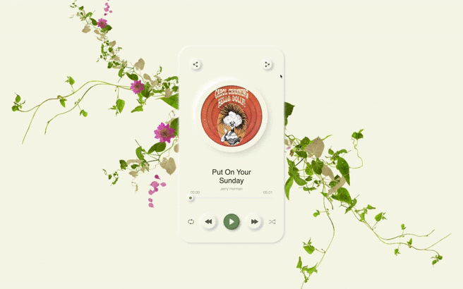
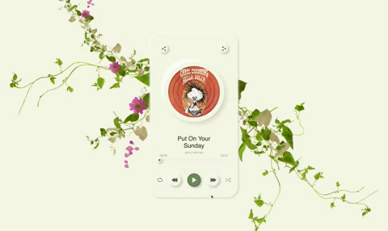
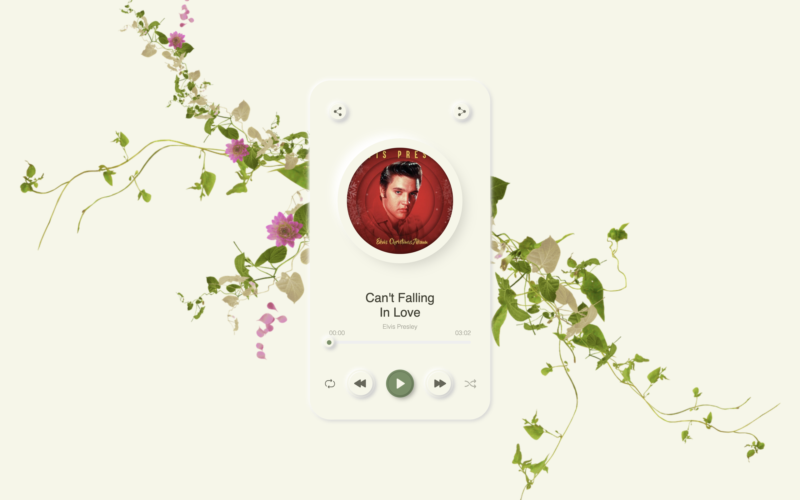
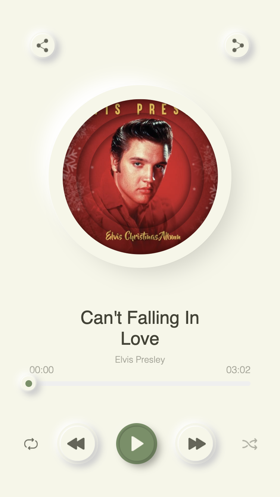

	
	
	  
	
	
	

<h2 align="center">Description</h2>

The project is a working music player made in the style of neomorphism.

- In the player it is possible:
	- to switch tracks;
	- rewind a track for 5 seconds forward and back;
	- use the music bar to scroll the track in more detail;
	- to enable repeat track;
	- to enable repeat playlist;
	- you can enable random track launch mode.

- [Demo](https://kerthin.github.io/musicPlayer-templateSait/)

#### Use technology.

The following technologies were used to create this project:

<h3 align="center">Task-Manager</h3>
<!--Task-Manager-->

	

	
<!--Task-Manager end-->

<h3 align="center">Software platform</h3>
<!--Software platform start-->

	

	
<!--Software platform end-->

<h3 align="center">Preprocessors</h3>

<!--Preprocessors start-->

	
	

<!--Preprocessors end-->

<h3 align="center">Package manager</h4>

<!--Package manager-->

	

<!--Package manager end-->

<h3 align="center">Languages</h4>

<!--Languages-->

	
	
	

<!--Languages end-->

---

## Plugins

To develop the project through gulp, I used the following types of NPM plugins:

| Plugin | Status | Description |
|---------|--------|-------------|
| [gulp-sourcemaps]   | [![gulp-sourcemaps-status]][gulp-sourcemaps-package]      | Intended for generation of `css source maps` which will be necessary at debugging of a code. |
| [gulp-imagemin]     | [![gulp-imagemin-status]][gulp-imagemin-package]          | Minify `PNG`, `JPEG`, `GIF` and `SVG` images with `imagemin` |
| [gulp-autoprefixer] | [![gulp-autoprefixer-status]][gulp-autoprefixer-package]  | Prefix `CSS` with `Autoprefixer` |
| [imagemin-pngquant] | [![imagemin-pngquant-status]][imagemin-pngquant-package]  | `Pngquant imagemin` plugin |
| [gulp-uglify]       | [![gulp-uglify-status]][gulp-uglify-package]              | Minify `JavaScript` with `UglifyJS3`. |
| [gulp-rigger]       | [![gulp-rigger-status]][gulp-rigger-package]              | `Rigger` is a build time include engine for `Javascript`, `CSS`, `CoffeeScript`. |
| [gulp-minify-css]   | [![gulp-minify-css-status]][gulp-minify-css-package]      | `Gulp` plugin to minify `CSS` |
| [rimraf]            | [![rimraf-status]][rimraf-package]                        | The `UNIX` command `rm` `-rf` for node. |
| [gulp-watch]        | [![gulp-watch-status]][gulp-watch-package]                | File watcher that uses super-fast chokidar and emits vinyl objects. |
| [gulp-pug]          | [![gulp-pug-status]][gulp-pug-package]                    | This `Gulp` plugin enables you to compile your `Pug` templates into `HTML` or `JS`.|
| [gulp-sass]         | [![gulp-sass-status]][gulp-sass-package]                  | Compilation of `sass` and `scss` files |
| [browser-sync]      | [![browser-sync-status]][browser-sync-package]            | Keep multiple browsers & devices in `sync` when building websites. |

[gulp-sourcemaps]:    https://www.npmjs.com/package/gulp-sourcemaps
[gulp-imagemin]:      https://www.npmjs.com/package/gulp-imagemin
[gulp-autoprefixer]:  https://www.npmjs.com/package/gulp-autoprefixer
[imagemin-pngquant]:  https://www.npmjs.com/package/imagemin-pngquant
[gulp-uglify]:        https://www.npmjs.com/package/gulp-uglify
[gulp-rigger]:        https://www.npmjs.com/package/gulp-rigger
[gulp-minify-css]:    https://www.npmjs.com/package/gulp-clean-css
[rimraf]:             https://www.npmjs.com/package/rimraf
[gulp-watch]:         https://www.npmjs.com/package/gulp-watch
[gulp-pug]:           https://www.npmjs.com/package/gulp-pug
[gulp-sass]:          https://www.npmjs.com/package/gulp-sass
[browser-sync]:       https://www.npmjs.com/package/browser-sync

[gulp-sourcemaps-status]:   https://img.shields.io/badge/npm-v2.6.4-blue.svg
[gulp-imagemin-status]:     https://img.shields.io/badge/npm-v4.1.0-blue.svg
[gulp-autoprefixer-status]: https://img.shields.io/badge/npm-v6.0.0-blue.svg
[imagemin-pngquant-status]: https://img.shields.io/badge/npm-v6.0.0-blue.svg
[gulp-uglify-status]:       https://img.shields.io/badge/npm-v3.0.1-blue.svg
[gulp-rigger-status]:       https://img.shields.io/badge/npm-v0.5.8-blue.svg
[gulp-minify-css-status]:   https://img.shields.io/badge/npm-v3.10.0-blue.svg
[rimraf-status]:            https://img.shields.io/badge/npm-v2.6.2-blue.svg
[gulp-watch-status]:        https://img.shields.io/badge/npm-v5.0.1-blue.svg
[gulp-pug-status]:          https://img.shields.io/badge/npm-v4.0.1-blue.svg
[gulp-sass-status]:         https://img.shields.io/badge/npm-v4.0.1-blue.svg
[browser-sync-status]:      https://img.shields.io/badge/npm-v2.24.7-blue.svg

[gulp-sourcemaps-package]:   https://www.npmjs.com/package/gulp-sourcemaps
[gulp-imagemin-package]:     https://www.npmjs.com/package/gulp-imagemin
[gulp-autoprefixer-package]: https://www.npmjs.com/package/gulp-autoprefixer
[imagemin-pngquant-package]: https://www.npmjs.com/package/imagemin-pngquant
[gulp-uglify-package]:       https://www.npmjs.com/package/gulp-uglify
[gulp-rigger-package]:       https://www.npmjs.com/package/gulp-rigger
[gulp-minify-css-package]:   https://www.npmjs.com/package/gulp-clean-css
[rimraf-package]:            https://www.npmjs.com/package/rimraf
[gulp-watch-package]:        https://www.npmjs.com/package/gulp-watch
[gulp-pug-package]:          https://www.npmjs.com/package/gulp-pug
[gulp-sass-package]:         https://www.npmjs.com/package/gulp-sass
[browser-sync-package]:      https://www.npmjs.com/package/browser-sync

## Documentation

#### The repository of this project is divided into several sections:

- `app` - this repository is intended for files with the help of which the project is being developed. It is from this repository that all project files are compiled, which are later transferred to the `dist` repository;
- `dist` - this folder is a repository where files from the `app` repository are compiled;
- `docs` - a repository intended for displaying the project on Github Pages servers.

#### The following describes in more detail the repository `app` and `dist`:

- `app` - this repository is divided into several folders and files:

	- `image` - all images for the site are stored in the folder;
	- `js` - this folder consists of the main js file called `main.js` folder `partial` inside which contains js files predlagaemye to initialize js plugins and the folder `libs` which contains js library;
	- `scss` - this folder consists of the main css file called `main.scss` and the folder `partial` in which are contained the various scss files and folder `libs` containing the scss library;
	- `template` - the folder contains 2 files `head.pug` and `scripts.pug`and folder `partials` inside which there are various pug files consisting of page blocks.

	- `index.pug` -  is the main file inside which page elements are created.

- `dist` - this repository is divided into several folders and files:

	- `image` - this folder stores minimized and processed images using gulp plugins such as `gulp-imagemin` and `imagemin-pngquant`;
	- `js` - this folder contains the main js file called `main.js` which was compiled and minified using the plugins `gulp-rigger` and `gulp-uglify`;
	- `css` - the folder contains the file `main.css` which contains all the basic styles of the page, the file has been compiled and and minified using the plugins `gulp-sass` and `gulp-minify-css`.

	- `index.html` - the file is the main html document of the page that has been compiled and minimized from `index.pug` file using the plugin `gulp-pug`.

#### This section describes how to work with `gulpfile.js` used in the project:

- `gulpfile.js` - this file is a configuration file designed to run tasks assigned by the developer:
	
	- `html:dist` - this command is run through the console by writing it `gulp html:dist`. This command is used to compile `pug` files, minimize them and transfer `pug` files to the `dist` repository;
	- `js:dist` - this command is run through the console by writing it `gulp js:dist`. This command is used to compile a file using the `rigger` plugin, create a `sourcemap`, minimize the file, and transfer it to the `dist` repository;
	- `style:dist` - this command is run through the console by writing it `gulp style:dist`. This command is used to compile `scss` files, minimize them, create `sourcemap`, and transfer files to the `dist` repository;
	- `image:dist` - this command is run through the console by writing it `gulp image:dist`. Use this command to minimize and transfer images to the `dist` repository;
	- `fonts:dist` - this command is run through the console by writing it `gulp fonts:dist`. Use this command to move fonts to the `dist` repository;
	- `dist` - this command is run through the console by writing it `gulp dist`. This command is designed to run several commands at the same time, such as: `html:dist`, `js:dist`, `style:dist`, `image:dist`, `fonts:dist`;
	- `watch` - this command is run through the console by writing it `gulp watch`. Use this command to monitor file changes;
	- `webserver` - this command is run through the console by writing it `gulp webserver`. This command is used to start the local web server;
	- `clean` - this command is run through the console by writing it `gulp clean`. This command is used to clean up the repository;
	- `default` - this command is run through the console by writing it `gulp default`.This command is used to run all tasks at the same time.

## Appearance

The image of the website:

- Gif
- Desktop Image
- Phone Image

#### Gif

	- Switch  
	

	- Playing  
	

#### Desktop

#### Phone

	- `414px`;
	- `375px`;
	- `320px`.
